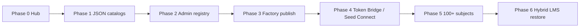
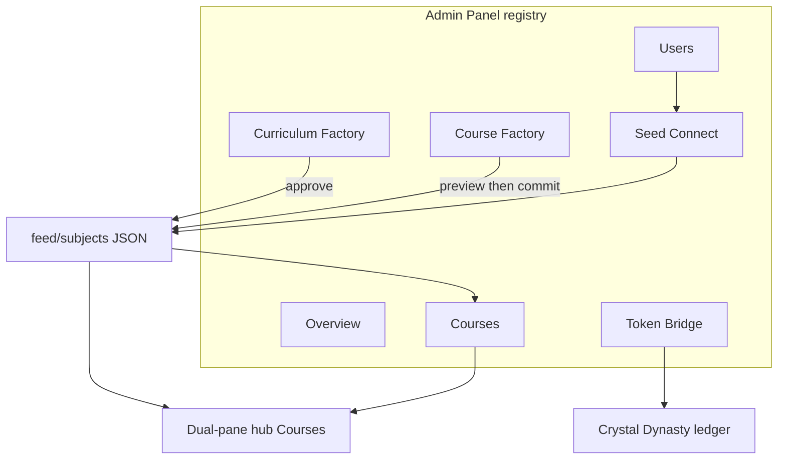
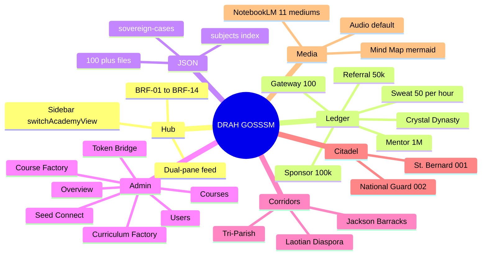
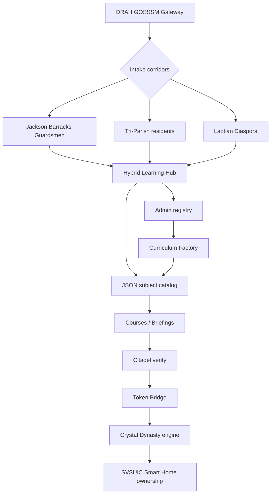
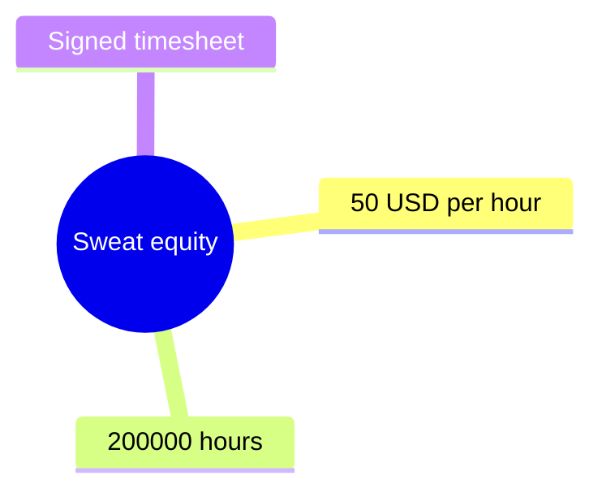

# DRAH GOSSSM Master SOP

**Document:** `DRAH_GOSSSM_MASTER_SOP.md`
**Repository:** `svsuicops-spec/mhbojt-core`
**Protocol:** DRAH GOSSSM — Goal · Objective · Strategy · System · Scale · Milestone
**Engine:** Crystal Dynasty (`/drah_crystal_dynasty1.html`)
**Public hub:** Hybrid Learning Hub dual-pane feed at `/` and `/feed` on mhbojt.site
**Locked Stripe:** `https://buy.stripe.com/8x228rcRfa087yu9P4cIE02`

This is the operating specification for mhbojt-core. It does not replace live HTML. It tells operators and agents how the platform scales from the current static dual-pane hub to a 100+ subject academy without baking curriculum into `index.html`.

---

## 1. Operating picture

DRAH GOSSSM is the long-horizon protocol. MHBOJT is the trade school. SVSUIC is the enterprise. FinAcademy / Hybrid Learning Hub is the candidate interface.

| Surface | Path | Job |
| --- | --- | --- |
| Dual-pane hub | `/`, `/feed`, `/feed/finacademy/` | Sidebar + briefing feed (BRF-01–14). Not the calculator. |
| Crystal Dynasty | `/drah_crystal_dynasty1.html` | $10M apprentice ledger, Action Tracks, NotebookLM 11-medium tray |
| St. Bernard | `/feed/st-bernard/` | Component #001 campus brief |
| National Guard | `/feed/national-guard/` | Component #002 Jackson Barracks pipeline |
| Case catalog | `/feed/sovereign-cases.json` | Versioned JSON briefings fetched by `briefing-stream.js` |
| Curriculum Factory | `packages/curriculum-factory` | SEARCH → VALIDATE → TRANSCRIBE → SYNTHESIZE → AUDIT |

**Ledger constants (do not fork):**

- Apprentice liability: **$10,000,000**
- Sweat equity: **$50 / Hr** → **200,000 Hours** neutralize
- Mentor: **$1,000,000** per completed mentee
- Sponsor: **$100,000** per underwritten candidate
- Referral: **$50,000** per converted introduction with a Stripe receipt
- Gateway: **$100** reservation (admits; does not neutralize)

**Intake corridors:** Jackson Barracks National Guardsmen, Tri-Parish residents, Laotian Diaspora. Diagnostic pair: Food Logic **SL / Share (SIL)** and Shelter Intent **Nation Builder (NB)**.

**Candidate tiers:** candidate (1) → apprentice (2) → associate (3) → nation_builder (4).

---

## 2. Phased development roadmap

Phases are sequential. A later phase does not rewrite the dual-pane hub into the calculator. Dynasty stays on the engine page.

### Phase 0 — Live hub (complete)

Static Hybrid Learning Hub on Vercel. Full-height sidebar. Right pane is briefing modules BRF-01–14. `switchAcademyView` routes Briefings, Courses, The Citadel, Dynasty, Blueprint, Walkthrough, Dashboard, Course Factory, Profile, Admin Panel. Crystal Dynasty iframes `/drah_crystal_dynasty1.html`. Stripe is the locked payment link.

### Phase 1 — JSON subject decoupling (in progress)

Stop adding training subjects as hard-coded HTML. Every subject is a JSON record. The hub fetches catalogs the same way `feed/briefing-stream.js` already fetches `/feed/sovereign-cases.json`. Target: **one renderer, many subjects**. First catalog is the 14 briefing modules plus the sovereign case studies. Expand without touching `index.html` layout chrome.

### Phase 2 — Admin Panel feature registry (this spec)

Stand up the seven admin modules listed in §4 as first-class registry entries: Overview, Users, Courses, Curriculum Factory, Course Factory, Token Bridge, Seed Connect. The static Admin Media Studio (NotebookLM drop + M4A→MP3) remains the media tray inside Admin, not a replacement for the registry.

### Phase 3 — Curriculum Factory publish path

`packages/curriculum-factory` already runs SEARCH → VALIDATE → TRANSCRIBE → SYNTHESIZE → AUDIT and **does not publish** until an admin approves. Wire the approve route so an audited job writes a subject JSON file (and optional course rows) instead of only `curriculum_modules` staging tables. Human review is mandatory.

### Phase 4 — Token Bridge and Seed Connect

Token Bridge maps sweat / mentor / sponsor / referral credits onto the Crystal Dynasty ledger and the RWA hand-off. Seed Connect binds intake corridors (Guardsmen, Tri-Parish, Diaspora) and SL/NB diagnostics to subject unlocks. Neither module credits hours that were not executed or verified at The Citadel.

### Phase 5 — 100+ training subjects at scale

Subject JSON files live under `feed/subjects/`. A manifest (`feed/subjects/index.json`) lists 100+ ids. The hub right pane pages or virtualizes the feed. No subject HTML templates. NotebookLM 11-medium payloads (`audio`, `interactive`, `slides`, `datatable`, `video`, `mindmap`, `reports`, `flashcards`, `quiz`, `infographic`, `artifact`) are fields on the subject, not separate pages.

### Phase 6 — Hybrid LMS restore (optional, gated)

Replit Hybrid LMS source (`artifacts/lms`, Clerk, PostgreSQL) is documented in `replit.md` and is not currently in the Vercel static tree. Restore only after Phases 1–5 ship on mhbojt.site. Cookie-based Clerk auth; no bearer tokens. Static JSON catalogs remain the public feed even if the React LMS returns.



---

## 3. Modular JSON data decoupling (100+ subjects)

### 3.1 Rule

**Layout is HTML. Doctrine is JSON.** `index.html` owns chrome (sidebar, `switchAcademyView`, Stripe). Subject copy, quizzes, mindmaps, and media bindings live in JSON files that any page may fetch.

Current proof: `feed/sovereign-cases.json` + `feed/briefing-stream.js` mounting `[data-briefing-ingest]`. CORS is already open on that JSON in `vercel.json`.

### 3.2 Directory contract

```
feed/
  sovereign-cases.json          # existing case catalog
  subjects/
    index.json                  # manifest of 100+ subject ids
    brf-01-diagnostic.json
    brf-02-sweat-equity.json
    ...
    {slug}.json                 # one file per subject
  briefing-stream.js            # generic catalog renderer
  admin-studio.js               # NotebookLM drop intake
```

`feed/subjects/index.json` is the only file the hub must fetch to list the feed. Detail views fetch `feed/subjects/{id}.json` on demand.

### 3.3 Manifest schema

```json
{
  "version": "2026-09-29",
  "title": "MHBOJT subject catalog",
  "note": "Versioned training catalog. Pages fetch on load. Not a live news wire.",
  "count": 14,
  "subjects": [
    {
      "id": "brf-01-diagnostic",
      "code": "BRF-01",
      "n": 1,
      "track": "capital",
      "title": "Diagnostic Profile",
      "status": "published"
    }
  ]
}
```

Tracks: `capital` | `replit` | `citadel` | `dynasty` | `corridor`. Status: `draft` | `audit` | `published` | `archived`. Unpublished ids never render on the public feed.

### 3.4 Subject record schema

Each `{id}.json` carries the briefing card plus optional NotebookLM mediums. Unknown medium keys are ignored.

```json
{
  "id": "brf-02-sweat-equity",
  "code": "BRF-02",
  "n": 2,
  "track": "capital",
  "title": "Sweat Equity",
  "body": "$50 per hour. 200,000 Hours neutralize the $10,000,000 apprentice liability.",
  "corridors": ["guardsmen", "tri-parish", "diaspora"],
  "ledger": { "rateUsdPerHour": 50, "hoursToNeutralize": 200000 },
  "href": null,
  "view": "courses",
  "audio": { "lead": "", "src": "/drah-dual-host-overview.mp3" },
  "slides": [],
  "mindmap": [],
  "quiz": [],
  "datatable": { "columns": [], "rows": [] }
}
```

`href` opens an external campus feed (`/feed/st-bernard/`, `/feed/national-guard/`, `/drah_crystal_dynasty1.html`). `view` switches an in-hub academy pane. One of the two is set, never both as competing landings.

### 3.5 Scaling to 100+

| Band | Count | Source |
| --- | --- | --- |
| BRF-01–14 | 14 | Dual-pane hub doctrine cards |
| Sovereign cases | 3+ | `feed/sovereign-cases.json` |
| CAP-01–06 / REP-01–06 | 12 | FinAcademy labs |
| MHBOJT stages | 7 | Planning through Exit & Perpetuity |
| Corridor packs | 9+ | Guardsmen, Tri-Parish, Diaspora × 3 depths |
| Factory output | remainder | Curriculum Factory AUDIT → approve → JSON |

New subjects are **files**, not pull requests that rewrite `index.html`. A factory-approved job writes `feed/subjects/{id}.json` and appends the manifest row. Vercel deploy picks it up.

### 3.6 Renderer

`briefing-stream.js` (or a successor `subject-stream.js`) fetches the manifest, renders `[data-subject-feed]`, and binds NotebookLM mediums the same way it already binds case `mindmap` / `slides` / `datatable`. Mermaid mindmaps in JSON compile at render time with `securityLevel: 'loose'`.

Do not embed 100 subject bodies in the dual-pane HTML. The right pane is a list of cards sourced from JSON.

---

## 4. Admin Panel feature registry

Admin is a **registry**, not a single form. Each module has an id, a pane, a data contract, and a publish rule. The static hub currently implements Course Factory preview and Admin Media Studio. The registry below is the target map.

| id | Module | Job | Data | Publish rule |
| --- | --- | --- | --- | --- |
| `overview` | **Overview** | Command KPIs: labs complete, $50/Hr rate, $10M liability, $100 gateway, corridor mix, factory job status | Dashboard JSON + Crystal Dynasty remaining | Read-only. No ledger writes. |
| `users` | **Users** | Candidate records: Clerk sync id, SL/NB pair, tier, corridor, sweat hours, Stripe receipt | `users` / `user_profiles` | Sync on sign-in (`POST /api/users/sync`). Hours credit only after Citadel verify. |
| `courses` | **Courses** | CAP/REP labs and published JSON subjects as course rows | `courses` / `modules` / `lessons` + `feed/subjects/` | Visible on hub Courses only when `status=published`. |
| `curriculum-factory` | **Curriculum Factory** | Ingest source URLs through SEARCH → VALIDATE → TRANSCRIBE → SYNTHESIZE → AUDIT | `curriculum_jobs` / `curriculum_modules` | Does **not** publish on job complete. Admin approve writes subject JSON. |
| `course-factory` | **Course Factory** | Compose the next feed module: title, track, verification rule | Hub `#factory` preview today; later writes a draft subject | Preview is local. Ship only via GitHub + Vercel (or approve API). |
| `token-bridge` | **Token Bridge** | Map sweat / mentor / sponsor / referral credits onto the Dynasty ledger and RWA hand-off | Ledger events; Stripe receipt id required for referrals | No credit without receipt or signed timesheet. Gateway $100 is not neutralization. |
| `seed-connect` | **Seed Connect** | Bind intake corridors and Seed / monthly contribution tracks to subject unlocks | Onboarding `mhbojt-onboarding` + corridor flags | Unlock is eligibility, not a paid bypass of the $10M liability. |

### 4.1 Overview

Shows the same four KPIs the hub Dashboard already paints (labs complete, sweat rate, liability target, gateway deposit) plus factory job counts (`searching` / `validating` / `failed` / `awaiting_audit`). Links out to Dynasty; does not iframe `/` as the engine.

### 4.2 Users

Clerk cookie session is the identity. Local row uses Clerk user id as primary key. Profile fields: Food Logic, Shelter Intent, corridor, tier. Referral-manager swarm alerts fire at 5 / 10 / 20 verified-candidate milestones (`pnpm --filter @workspace/scripts run referral-manager`).

### 4.3 Courses

Public Courses view lists published subjects grouped by track. Completion is per-lab (`finacademy-lab-progress` on the static hub; lesson completion rows on the LMS). Mark complete only after the verification rule is true.

### 4.4 Curriculum Factory

Canonical pipeline in `packages/curriculum-factory/src/main.ts`:

1. **SEARCH** — resolve each source URL to metadata.
2. **VALIDATE** — duration and relevance gates; exclusions are noted, not silent.
3. **TRANSCRIBE** — captions, ASR fallback.
4. **SYNTHESIZE** — Gemini structures a course from surviving sources.
5. **AUDIT** — stage `curriculum_modules` for human review.

Approve is a separate admin action. Rejected jobs never appear in `feed/subjects/index.json`.

### 4.5 Course Factory

Hub pane `#factory`: title, track (`capital` / `replit` / `citadel`), verification rule, **Preview Module Card**. Preview is not production. Production is a subject JSON commit or an approved factory job.

GOSSSM fields on a generated course: Goal, Objective, Strategy, System, Scale, Milestone. Depth options (Hybrid LMS): 5-minute deep dive vs 30-minute masterclass.

### 4.6 Token Bridge

Credits:

| Track | Unit | Credit |
| --- | --- | --- |
| Sweat | Signed hour | $50 |
| Mentor | Completed mentee | $1,000,000 |
| Sponsor | Underwritten candidate | $100,000 |
| Referral | Converted intro + Stripe | $50,000 |

Bridge posts a ledger event the Dynasty sliders can reflect. Name-drops do not credit. Hours not executed or verified at The Citadel do not credit.

### 4.7 Seed Connect

Connects the onboarding gate (SL vs NB, referring / sponsoring / mentoring / learning the trade) to subject unlocks and the Crystal Dynasty seed / monthly contribution map. Corridor tags (`guardsmen`, `tri-parish`, `diaspora`) filter the JSON feed. Seed Connect does not mint tokens; Token Bridge does.



---

## 5. Interactive Mermaid.js mindmap architecture

### 5.1 Runtime

Every hub and engine page that compiles diagrams uses:

```js
mermaid.initialize({ startOnLoad: false, theme: 'dark', securityLevel: 'loose' });
```

- `startOnLoad: false` — diagrams live inside `switchAcademyView` / NotebookLM frames; call `mermaid.run({ nodes })` after inject.
- `theme: 'dark'` — zinc/amber hub.
- `securityLevel: 'loose'` — required for `click` nodes (Dynasty engine URL). Tight mode drops `click`.

NotebookLM medium `mindmap` is a first-class output. JSON `mindmap` arrays (see `feed/sovereign-cases.json`) compile to Mermaid `mindmap` blocks at render time in `briefing-stream.js`.

### 5.2 Platform mindmap (canonical)

Paste into any pane that already loads Mermaid. Keep node labels short; Mermaid mindmap wrapping is brittle.



### 5.3 Architecture flow (clickable)



### 5.4 Subject JSON → mindmap compile

A subject `mindmap` field is data, not HTML:

```json
"mindmap": [
  { "label": "Sweat equity", "children": ["50 USD per hour", "200000 hours", "Signed timesheet"] }
]
```

Renderer emits:



Then `mermaid.run({ nodes: [el] })`. Do not ship 100 compiled SVG files. Compile on the client from JSON.

### 5.5 Blueprint view

Hub `#blueprint` already runs Mermaid after `switchAcademyView('blueprint')`. New architecture diagrams belong in JSON or this SOP, then in the Blueprint pane — not as a second homepage.

---

## 6. Non-negotiables

1. Root `index.html` is the Hybrid Learning Hub dual-pane feed, not the Crystal Dynasty calculator.
2. Stripe stays `https://buy.stripe.com/8x228rcRfa087yu9P4cIE02`.
3. `$100` admits. It does not clear the `$10M` liability.
4. Quiz card #8 (when present) is **200,000 Hours**.
5. Agents cannot merge to `main`; operators squash-merge or push. Hard-refresh after deploy (`Ctrl+F5` / `Cmd+Shift+R`).
6. Subject growth is JSON files under `feed/subjects/`, never a 10,000-line `index.html`.

---

## 7. Related files

| File | Role |
| --- | --- |
| `index.html` | Dual-pane hub entry |
| `drah_crystal_dynasty1.html` | Crystal Dynasty + NotebookLM |
| `feed/sovereign-cases.json` | Case catalog pattern for subjects |
| `feed/briefing-stream.js` | JSON ingest renderer |
| `feed/admin-studio.js` | Admin media tray |
| `packages/curriculum-factory` | Factory pipeline |
| `ARCHITECTURE.md` | Target-group gateway sketch |
| `replit.md` | Hybrid LMS runbook (React / Clerk / PG) |
| `vercel.json` | Host rewrite + catalog CORS |
